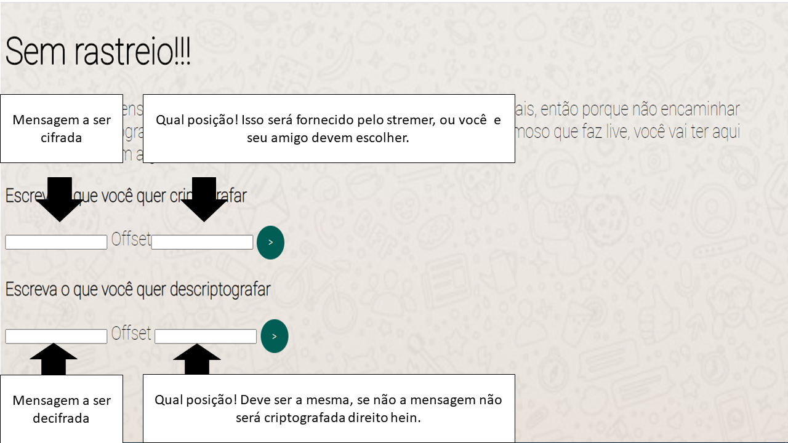

# **Cifra de César** <h1>
=======
#Cifra de César

## Índice

* [1. Prefácio]
* [2. Resumo do projeto]
* [3. Prototipo]
* [4.Interface do Usuario (UI)] 
* [5. Metodologia utilizadas]

## 1. Prefácio
Este projeto irá apresentar uma prévia dos conhecimentos adquiridos até esta data,
realizando assim uma aplicação a cifra de cesar disposta pela proposta educacional da Laboratoria.  

## 2. Resumo do projeto

Este projeto em especial, é voltado para o público jovem, adolescentes que estão 24hrs na internet, sejam jogando 
ou assistindo alguém jogar em alguma live. E como bem sabemos, esses jovens constantemente são acompanhados 
pelos pais, sendo assim, eles não possuem privacidade alguma para trocar confidencias com seus amigos.
Meu projeto aborta uma proposta simples, com base na interface do "Whatsapp", onde os jovens poderão 
digitar mensagens ou até mesmo codigos de stremers para trocar com amigos ou utilizar na Steam, ou em qualquer
outro app que esteja patrocinando o video.
O projeto codiguim irá auxiliar jovens adolescentes a interarir de forma mais dinamica com os amigos e com o meio.

## 3. Prototipo

### Interface do usuário (UI)

### Metodologias utilizadas:
* Vanilla JavaScript;
* HTML;
* CSS.

:rocket:

***

